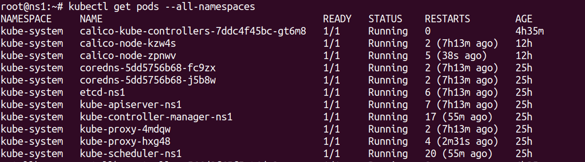
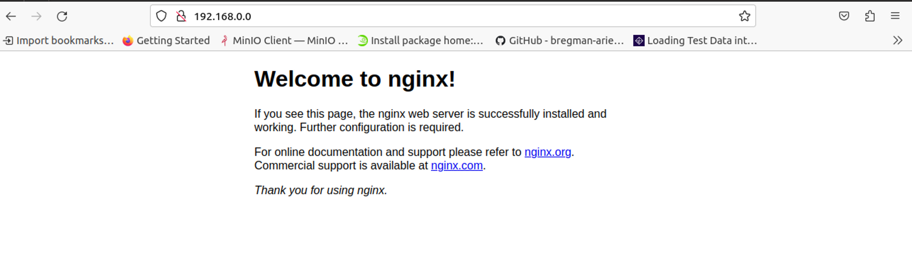

## Metallb setup on Kubernetes cluster

- **Metallb**
    
    ## **[1 . Requirement of MetalLB](https://64dc91a6ec22134a66be2ca2--remarkable-meringue-804b9a.netlify.app/#/?id=_1-requirement-of-metallb)**
    
    In the bare metal deployment kubernetes does not provide the functionality of creating Load Balancer on service by default
    
    ## **[2 . Environment detail :](https://64dc91a6ec22134a66be2ca2--remarkable-meringue-804b9a.netlify.app/#/?id=_2-environment-detail-)**
    
    - **OS: Ubuntu 20.04.6 LTS**
    
    ## **[3 . List of tools and technologies:](https://64dc91a6ec22134a66be2ca2--remarkable-meringue-804b9a.netlify.app/#/?id=_3-list-of-tools-and-technologies)**
    
    - **Kubernetes**
    - **MetalLB**
    - **Podman/Docker**
    
    ### **[a . What is Kubernetes ?](https://64dc91a6ec22134a66be2ca2--remarkable-meringue-804b9a.netlify.app/#/?id=a-what-is-kubernetes-)**
    
    Think of Kubernetes as a smart manager for your applications. Imagine you have lots of little workers (containers) who need to run your programs. Kubernetes is like a boss who organises and manages these workers efficiently. It makes sure your programs are running, scales them when needed, and even replaces them if they fail.
    
    ### **[b . What is MetalLB ?](https://64dc91a6ec22134a66be2ca2--remarkable-meringue-804b9a.netlify.app/#/?id=b-what-is-metallb-)**
    
    Picture MetalLB as a friendly valet for your apps in Kubernetes. Normally, LoadBalancers help direct internet traffic to different services, like websites or apps. MetalLB does this even if you're not on a big cloud service (like Amazon or Google). It helps your Kubernetes apps get the right traffic and lets them talk to the world.
    
    ## **[4 . Command for the setup or configuration :](https://64dc91a6ec22134a66be2ca2--remarkable-meringue-804b9a.netlify.app/#/?id=_4-command-for-the-setup-or-configuration-)**
    
    ### **[a . Install Kubernetes](https://64dc91a6ec22134a66be2ca2--remarkable-meringue-804b9a.netlify.app/#/?id=a-install-kubernetes)**
    
    Here's a general outline of the steps you would follow to install Kubernetes on Ubuntu:
    
    **Step 1 .Update the system's package list and install necessary dependencies using the following commands:**
    
    ```bash
    sudo apt-get update
    ```
    
    ---
    
    **Step 2 :** **Install Docker :** Kubernetes relies on Docker for containerization. Install Docker using the following commands:
    
    ```bash
    
    sudo apt-get install docker.io
    sudo systemctl start docker
    ```
    
    ---
    
    **Step 3 :** **Install kubeadm, kubelet, and kubectl :** These are the essential components of Kubernetes.
    
    ```bash
    sudo apt-get install -y apt-transport-https curl
    curl -s https://packages.cloud.google.com/apt/doc/apt-key.gpg | sudo apt-key add -
    
    echo "deb https://apt.kubernetes.io/ kubernetes-xenial main" | sudo tee /etc/apt/sources.list.d/kubernetes.list
    sudo apt-get update
    sudo apt-get install -y kubelet kubeadm kubectl
    
    ```
    
    ---
    
    **Disable swap using the following command:**
    
    ```bash
    sudo swapoff -a
    ```
    
    ---
    
    **If there are any swap entries in the /etc/fstab file, remove them using a text editor such as vim:**
    
    ```bash
    sudo vim /etc/fstab
    ```
    
    ---
    
    **Enable kernel modules**
    
    ```bash
    sudo modprobe br_netfilter
    ```
    
    ---
    
    **Add some settings to sysctl**
    
    ```bash
    sudo sysctl -w net.ipv4.ip_forward=1
    ```
    
    ---
    
    ## **Initialize the Cluster (Run only on master)**
    
    **Step 4 :** **Initialize Kubernetes Master Node (Control Plane) :** On the master node, you'll initialize Kubernetes using kubeadm. Run the following command to initialize the master node:
    
    ```bash
    sudo kubeadm init
    ```
    
    ---
    
    Follow the instructions provided by the command, including setting up the network pod (CNI) and configuring kubectl for your user.
    
    **Step 5 :** **Configure Kubectl :** You need to configure kubectl to communicate with the Kubernetes cluster. This is usually done by copying the Kubernetes configuration file into your home directory.
    
    ```bash
    mkdir -p $HOME/.kube
    
    sudo cp -i /etc/kubernetes/admin.conf $HOME/.kube/config
    
    sudo chown $(id -u):$(id -g) $HOME/.kube/config
    ```
    
    ---
    
    **Step 6 :** **Install a Network Plugin :**
    
    Kubernetes requires a network plugin for communication between pods across different nodes. A popular choice is Calico
    
    **NOTE:** This command is run only on Master Node
    
    ```bash
    kubectl apply -f https://docs.projectcalico.org/v3.14/manifests/calico.yaml
    ```
    
    ---
    
    **Verify that all the pods are up and running:**
    
    
    
    
    **Step 7 :** **Join Worker Nodes (optional) :**If you have worker nodes, you can join them to the cluster using the token generated during kubeadm init on the master node.
    
    But Before join the worker node we have to perform all the command  which is given above (only except **calico** or **initialize** command because we have to run this command on master node)
    
    **Running this command on Worker node**
    
    ```bash
    kubeadm join 192.168.0.107:6443 --token u6yolp.oosln2n1w8dqh7xi --discovery-token-ca-cert-hash sha256:91be4cbaec60a47796be311845864a1790181f9faa7668c8819e727596bb2d1d
    ```
    
    ---
    
    .png)
    
    
    ### **[b . Install MetalLB](https://64dc91a6ec22134a66be2ca2--remarkable-meringue-804b9a.netlify.app/#/?id=b-install-metallb)**
    
    MetalLB is a load balancer implementation for bare metal Kubernetes clusters. It provides a network load balancer implementation for services that use the type LoadBalancer.
    
    ```bash
    kubectl create ns metallb
    ```
    
    ---
    
    ```bash
    helm install metallb metallb/metallb
    ```
    
    MetalLB is now running in the cluster
    
    ---
    .png)
   
    
    The **sipcalc** command is a tool used for calculating various properties of IP addresses and subnets
    
    ```bash
    sipcalc 192.168.0.107/24
    ```
    
    ---
    
    **Create ConfigMap for MetalLB**
    
    ```bash
    cat cm.yaml
    ```
    
    ```yaml
    apiVersion: v1
    kind: ConfigMap
    metadata:
      name: config
    data:
      config: |
    	address-pools:
    	- name: default
      	protocol: layer2
      	addresses:
      	- 192.168.0.1-192.168.0.254
    ```
    
    ---
    
    ```yaml
    kubectl apply -f cm.yaml
    ```
    
    If above config file is not working due metallb version   then apply this manifest file for ipaddress pool
    
    ```yaml
    root@ns1:~# cat addresspool.yaml 
    apiVersion: metallb.io/v1beta1
    kind: AddressPool
    metadata:
      name: doc-example-cidr
      namespace: default
    spec:
    protocol: layer2
    addresses:
    - 192.168.122.192/24

    ```
    
    
    ```yaml
    kubectl apply -f addresspool.yaml
    ```
    
    ---
    
    **8.Deploy a sample nginx application.**
    
    ```yaml
    kubectl create deploy nginx --image nginx
    ```
    
    ---
    
    ```yaml
    kubectl expose deploy nginx --port 80 --type LoadBalancer
    ```
    
    ---
    
    Now you can configure it via its CRs. Please refer to the metallb official docs
    
    on how to use the CRs.
    
    You should see an IP address assigned to the **EXTERNAL-IP** column.
    
    MetalLB is now **set up** in your Kubernetes cluster running on Ubuntu. It's helping to distribute traffic and make your applications accessible through the IP you've configured
    
    .png)
    
    
    **Now hit on browser with http://192.168.0.0:80**
    
    

    
    
    Reference link for Setup kubernetes cluster
    
    [https://www.linuxtechi.com/install-kubernetes-on-ubuntu-22-04/](https://www.linuxtechi.com/install-kubernetes-on-ubuntu-22-04/)
    
    Metallb installation with helm chart
    
    [https://metallb.universe.tf/installation/](https://metallb.universe.tf/installation/)
    
    </aside>


